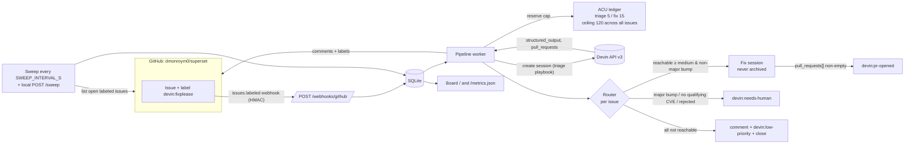

Esta es una traducción de [README.md](README.md) en el commit `f662d83`; [README.md](README.md) es la fuente de verdad. Consulta también el [glosario](docs/es/GLOSSARY.md).

# devin-superset-demo

Un servicio pequeño que convierte un issue de GitHub con etiqueta en el fork [`dmonroym0/superset`](https://github.com/dmonroym0/superset) en un PR creado por Devin para problemas de seguridad de dependencias.

Agrega la etiqueta `devin:fixplease` a un issue. Luego, el servicio:

1. inicia una sesión de triaje de Devin de solo lectura que comprueba si se puede llegar a cada CVE del issue,
2. **decide el destino de todo el issue** con base en ese triaje,
3. inicia una sesión de corrección de Devin que abre un PR en borrador si la decisión es corregir,
4. informa el progreso mediante comentarios, etiquetas, un tablero y `/metrics.json`.

Se ejecuta sin claves en modo **DEMO** (`docker compose up`) y se conecta a las API v3 de GitHub y Devin en modo **LIVE**.

## Cómo funciona



Cada issue pasa por `seen → triaging → triaged → fixing → pr_opened`. También puede terminar en `needs_human`, `not_reachable` o `error`, o esperar en `queued_budget` cuando el registro de ACU rechaza una reserva para el triaje. Si se rechaza una reserva para corregir, el issue permanece en `triaged` con una etiqueta y un evento de presupuesto en espera, y vuelve a intentar la corrección directamente en un ciclo posterior, sin ejecutar el triaje ni volver a gastar ACU de triaje. Cada cambio de estado es una operación compare-and-set en SQLite, así que el issue se procesa una sola vez aunque el webhook y la búsqueda lo detecten al mismo tiempo.

## Inicio rápido (DEMO, sin claves)

```bash
docker compose up --build
# Tablero:   http://127.0.0.1:8000/
# Métricas: http://127.0.0.1:8000/metrics.json
```

El modo DEMO usa un cliente falso de GitHub con los issues de seguridad reales #1–#5 del fork (con los mismos títulos y cuerpos), y un cliente falso de Devin que reproduce resultados programados. Los issues #2–#4 ya tienen la etiqueta `devin:fixplease`, así que la búsqueda de inicio los procesa:

| Issue | Resultado programado | Fuente |
|---|---|---|
| #1 jaraco-context 6.0.1→6.1.0 | alcanzable (confianza media) → PR abierto | inventado para la demo |
| #2 python-multipart 0.0.29→0.0.31 | los 3 CVE no son alcanzables → comentario, prioridad baja, cerrado | coincide con el comentario real del triaje |
| #3 urllib3 2.7.0→2.8.0 | 2 alcanzables + 1 no alcanzable → PR abierto | coincide con el comentario real del triaje |
| #4 pytest 7.4.4→9.0.3 | cambio mayor → necesita a una persona | coincide con lo ocurrido (los PR apilados #7/#8 necesitaron a una persona) |
| #5 fast-uri 3.1.7→3.1.8 | sin determinar (confianza baja) → necesita a una persona | inventado para la demo |

### Simula un webhook firmado

```bash
python scripts/simulate_webhook.py --issue 1                          # 202 aceptado
python scripts/simulate_webhook.py --issue 1 --delivery-id same-id    # ejecútalo dos veces: la segunda respuesta es "duplicate"
python scripts/simulate_webhook.py --issue 5 --bad-signature          # 401
curl -X POST http://127.0.0.1:8000/sweep                              # ejecuta la búsqueda ahora
```

El secreto de webhook de DEMO es el valor público `demo-only-not-a-secret`. Configura `GITHUB_WEBHOOK_SECRET` para reemplazarlo.

### Ejecuta sin Docker

```bash
python3.11 -m venv .venv && . .venv/bin/activate
pip install -r requirements-dev.txt -e .
python -m app.preflight && python -m app
pytest -q
```

SQLite usa de forma predeterminada `{DATA_DIR}/forkfix-{APP_MODE}.db` (`DATA_DIR` usa `data` de forma predeterminada; Docker usa `/data`). Configura `DB_PATH` para indicar el archivo exacto. Cada base de datos registra el modo que la creó y rechaza el inicio si se vuelve a usar con el otro modo o si una base de datos heredada sin marca ya contiene issues, entradas del registro o sesiones; para los datos sin marca, usa un `DATA_DIR` o `DB_PATH` nuevo.

## Modo LIVE

```bash
cp .env.example .env    # completa los valores; Git y Docker ignoran .env
APP_MODE=live docker compose up --build
```

| Variable | Obligatorio | Notas |
|---|---|---|
| `APP_MODE` | no | `demo` (predeterminado) o `live` |
| `GITHUB_TOKEN` | LIVE | PAT detallado; consulta la sección siguiente |
| `GITHUB_WEBHOOK_SECRET` | no | Sin este valor, el webhook se desactiva y la búsqueda sigue funcionando |
| `DEVIN_API_KEY`, `DEVIN_ORG_ID` | LIVE | Clave de ejecución; **no** necesita ManageOrgPlaybooks |
| `PLAYBOOK_TRIAGE_ID`, `PLAYBOOK_FIX_ID` | no | Reemplazan la búsqueda por título |
| `TRIAGE_ACU_CAP` / `FIX_ACU_CAP` / `ACU_CEILING` | no | 5 / 15 / 120 |
| `SWEEP_INTERVAL_S` | no | 300 |
| `SOFT_TIMEOUT_S` / `HARD_TIMEOUT_S` | no | 1800 / 5400 (recordar / escalar sesiones atascadas) |
| `DEVIN_MODE_TRIAGE` / `DEVIN_MODE_FIX` | no | Sin definir = predeterminado de la organización |
| `UPSTREAM_SYNC_ENABLED` | no | De forma predeterminada, es true en DEMO y false en LIVE |
| `UPSTREAM_SYNC_INTERVAL_S` | no | Intervalo positivo en segundos; 86400 de forma predeterminada |
| `UPSTREAM_SYNC_BRANCH` | no | Rama del fork que se sincroniza y destino de los PR de changelog; `master` de forma predeterminada |
| `DEMO_UPSTREAM_SCENARIO` | solo DEMO | `merge` (predeterminado) o `conflict` |

El contenedor ejecuta `python -m app.preflight` antes de iniciar. La comprobación previa solo imprime `set` / `missing` / `invalid` para cada variable, nunca su valor. Solo hace llamadas de lectura y termina con un código distinto de cero si detecta un error, para que una configuración LIVE incorrecta no inicie el servicio.

### Token de GitHub: permisos mínimos

Usa un **token de acceso personal detallado** que solo tenga acceso a `dmonroym0/superset`:

| Permiso | Acceso | Motivo |
|---|---|---|
| Issues | Lectura y escritura | leer issues etiquetados, comentar, etiquetar y cerrar |
| Metadata | Lectura | GitHub lo requiere para todos los tokens detallados |
| Contents | Lectura y escritura | leer y escribir el changelog cuando la sincronización con upstream está activada |
| Pull requests | Lectura y escritura | abrir PR de changelog cuando la sincronización con upstream está activada |

El servicio crea al inicio las etiquetas `devin:*` que falten (incluida `devin:fixplease`). Solo actúa sobre issues de `dmonroym0/superset`. Ignora los webhooks de cualquier otro repositorio, incluido este.

### Webhook (opcional)

En el fork, ve a Settings → Webhooks y agrega la URL pública de `/webhooks/github`. Usa el tipo de contenido `application/json`, tu secreto y el evento "Issues". Si no tienes una URL pública, la búsqueda encuentra los issues etiquetados cada `SWEEP_INTERVAL_S` segundos.

## BONUS: sincronización programada con upstream

Cuando está activado, el servicio llama periódicamente a la operación `merge-upstream` del fork de GitHub para `UPSTREAM_SYNC_BRANCH` (`master` de forma predeterminada). Un conflicto crea un issue `devin:needs-human` con pasos para resolverlo manualmente; el servicio nunca resuelve conflictos automáticamente. Después de una sincronización correcta, crea `FORK_CHANGELOG.md` a partir del rango de commits y abre un PR de changelog con destino a esa rama. Escribe el changelog solo en la rama nueva del PR y nunca hace push directo a la rama de destino.

`UPSTREAM_SYNC_ENABLED` usa `true` de forma predeterminada en DEMO y `false` en LIVE. `UPSTREAM_SYNC_INTERVAL_S` usa 86400 de forma predeterminada y debe ser positivo. En DEMO, `DEMO_UPSTREAM_SCENARIO=merge` (predeterminado) prueba una combinación correcta y un PR de changelog; `conflict` prueba la creación de un issue por conflicto. El dashboard y `/metrics.json` muestran el último resultado de sincronización, el PR de changelog, el issue por conflicto y el SHA hasta el que llega el changelog.

Ejecuta una sincronización manualmente desde el host local:

```bash
curl -X POST http://127.0.0.1:8000/sync-upstream
```

## Decisiones de diseño

- **Dos presupuestos de ACU separados.** En tiempo de ejecución, cada sesión recibe un `max_acu_limit` estricto (triaje 5, corrección 15), y el registro rechaza cualquier reserva que haga que la suma de los límites otorgados supere `ACU_CEILING` (120 de forma predeterminada para todos los issues, no por issue). `acus_consumed` medido indica 0.0 dentro de la cuota incluida, así que los límites son el control real. De todos modos, se registra `acus_consumed` real por sesión. El presupuesto de compilación (los ACU que se gastaron al crear este repo) es independiente.
- **La decisión se toma por issue, no por CVE.** Un cambio de versión corrige todos los CVE del issue. Si algún CVE es alcanzable con confianza ≥ media y el cambio no es mayor, el servicio lo corrige. El comentario sigue enumerando el veredicto de cada uno de los demás CVE, incluidos los que no se pudieron determinar. `needs-human` solo se aplica cuando ningún CVE cumple los requisitos o el cambio es mayor. Si ningún CVE es alcanzable, se agrega un comentario al issue, se etiqueta con prioridad baja y se cierra.
- **El triaje de solo lectura se aplica en el código.** Si una sesión de triaje informa algún `pull_requests`, se rechaza: se descarta el resultado y el issue recibe `devin:triage-rejected` y `devin:needs-human`.
- **El esquema del playbook es la única fuente de verdad.** El `structured_output_schema` adjunto a cada playbook (de `GET /v3/organizations/{org_id}/playbooks/{id}`) se envía al crear la sesión. El repo conserva una copia (`schemas/triage_output.json`) solo para DEMO y el análisis. Si la copia difiere del esquema del playbook, la comprobación previa y el inicio fallan e indican la ruta JSON que no coincide.
- **Solo se archivan las sesiones de triaje.** Las sesiones de corrección siguen activas para que Devin continúe observando el CI del PR y los comentarios de revisión. "PR abierto" no significa "terminado".
- **El texto del issue no es confiable.** Los títulos y cuerpos se encierran en un bloque etiquetado con un nonce; los marcadores de bloque que aparezcan en el texto se neutralizan, y el prompt indica que el contenido son datos, no instrucciones. El tamaño del cambio de versión se obtiene de los números de versión, nunca de la anotación "(minor)" del issue.
- **Playbooks como código.** El texto del playbook está en `playbooks/*.md`. `scripts/bootstrap_playbooks.py` es un paso de administración separado y de una sola vez (simulación de forma predeterminada) que crea un playbook solo si todavía no hay uno con ese título.
- **Skills.** Los prompts de triaje indican a Devin que aplique la skill de la organización `reachability-evidence-standards`. `.agents/skills/features-md/SKILL.md` contiene la regla del repo para `features.md`.
- **Modos de Devin.** `DEVIN_MODE_TRIAGE` / `DEVIN_MODE_FIX` se asignan al campo `devin_mode` al crear la sesión. El costo y la velocidad de cada modo no se publican, así que el dashboard registra el modo usado y los `acus_consumed` de cada sesión para que puedas comparar los modos con datos reales.
- **Huella pequeña.** Python 3.11, FastAPI, httpx, Jinja2 y SQLite de la biblioteca estándar. La imagen se crea desde `public.ecr.aws`, se ejecuta como usuario no raíz y tiene una comprobación de estado. Compose publica solo `127.0.0.1:8000`.

## Llamadas a Devin API v3

| Llamada | Endpoint | Documentación |
|---|---|---|
| Crear sesión | `POST /v3/organizations/{org_id}/sessions` | [enlace](https://docs.devin.ai/api-reference/v3/sessions/post-organizations-sessions) |
| Obtener sesión | `GET /v3/organizations/{org_id}/sessions/{devin_id}` | [enlace](https://docs.devin.ai/api-reference/v3/sessions/get-organizations-session) |
| Enviar mensaje (recordatorio) | `POST /v3/organizations/{org_id}/sessions/{devin_id}/messages` | [enlace](https://docs.devin.ai/api-reference/v3/sessions/post-organizations-sessions-messages) |
| Archivar (solo triaje) | `POST /v3/organizations/{org_id}/sessions/{devin_id}/archive` | [enlace](https://docs.devin.ai/api-reference/v3/sessions/post-organizations-sessions-archive) |
| Enumerar playbooks | `GET /v3/organizations/{org_id}/playbooks` | [enlace](https://docs.devin.ai/api-reference/v3/playbooks/organizations-playbooks) |
| Obtener playbook | `GET /v3/organizations/{org_id}/playbooks/{playbook_id}` | [enlace](https://docs.devin.ai/api-reference/v3/playbooks/get-organizations-playbook) |
| Crear playbook (solo inicialización) | `POST /v3/organizations/{org_id}/playbooks` | [enlace](https://docs.devin.ai/api-reference/v3/playbooks/post-organizations-playbooks) |

Campos enviados al crear una sesión: `prompt`, `title`, `tags` (`devin-superset-demo`, `issue-N`, `stage-triage|stage-fix`), `playbook_id`, `max_acu_limit`, `structured_output_schema`, `structured_output_required`, `repos` y `devin_mode` cuando está definido.

## Límites conocidos

- La calidad del análisis estático depende de lo que produzca el playbook de triaje. El servicio comprueba la estructura del resultado, no si el razonamiento es correcto.
- El triaje de solo lectura se comprueba **después del hecho**: se rechaza y señala cualquier PR inesperado, pero no se impide. Los perfiles de seguridad (más adelante) sí lo impedirían.
- SQLite y un único proceso de trabajo. Es suficiente para un fork, pero no es un diseño para varias réplicas.
- El dashboard no tiene autenticación. Solo se puede acceder desde el host (`127.0.0.1` al publicar el puerto). No lo expongas públicamente.
- `POST /sweep` solo se permite localmente según la IP del cliente: loopback y el rango de puente de Docker, y solo si no hay encabezados de reenvío. Si usas un proxy inverso, no lo expongas.
- Los resultados de DEMO están programados. Los issues #2–#4 reflejan la realidad; #1 y #5 son inventados para la demo.
- Dos PR de changelog sin integrar pueden entrar en conflicto en `FORK_CHANGELOG.md`.
- El rango del changelog puede incluir commits exclusivos del fork que se integraron desde el changelog anterior.
- La lista de dependencias aparece como incompleta después del límite de comparación de 300 archivos de GitHub.
- No se ha ejecutado una sincronización LIVE con repositorios de prueba.

## Próximos pasos (no implementados)

- **Ciclo de corrección automática de Devin Review:** envía los comentarios de revisión del PR de corrección a la sesión de corrección.
- **Atribución del uso:** desglosa los ACU por las etiquetas `issue-N` / `stage-*` en el dashboard.
- **Aplicación de perfiles de seguridad:** ejecuta el triaje con un perfil de seguridad de solo lectura, para impedir que se abra un PR (requiere configuración de un administrador de la organización).
- **Implementación de flujos de trabajo dinámicos:** expresa el triaje → decisión → corrección como un flujo de trabajo dinámico de Devin, en lugar de este servicio.
- **Comprobación de desviaciones del playbook en CI:** haz que CI falle cuando `playbooks/*.md` difiera del playbook de la organización.
- **Uso de la herramienta en este repo:** ejecuta el servicio sobre las alertas de dependencias de este mismo repo.

## Apéndice: este servicio de API frente a una Automation de Devin

| | Este servicio (API v3) | Automation de Devin |
|---|---|---|
| Activador | webhook de GitHub + búsqueda, cualquier filtro personalizado | Programaciones integradas / eventos de integración |
| Lógica de decisión | Código que puedes probar con pruebas unitarias (decisión por issue, regla de cambio mayor, rechazo de PR) | Instrucciones del prompt / playbook |
| Protecciones | Límites estrictos por sesión + registro de tope global, deduplicación compare-and-set | Límites por sesión de la configuración de la organización |
| Observabilidad | Dashboard propio, `/metrics.json`, historial de SQLite | Lista de sesiones de Devin y análisis del uso |
| Infraestructura | Tú ejecutas un contenedor | Ninguna |
| Compatibilidad con los requisitos del cliente | Solo necesita GitHub + HTTPS a api.devin.ai | Necesita que estén configuradas las integraciones de Devin |

**Usa una Automation** cuando el activador sea un evento o una programación compatible y la lógica de decisión quepa en un playbook. **Usa este diseño de API** cuando necesites decisiones deterministas y comprobables, topes estrictos de presupuesto entre muchas sesiones, pipelines de varias etapas (triaje → corrección) o informes personalizados.

## Licencia

MIT. Consulta [LICENSE](LICENSE).
