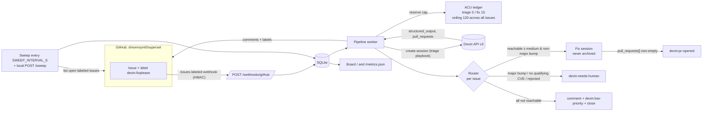

# devin-superset-demo

A small service that turns a labeled GitHub issue on the fork [`dmonroym0/superset`](https://github.com/dmonroym0/superset) into a Devin-made pull request for dependency security issues.

Label an issue `devin:fixplease`. The service then:

1. starts a **read-only** Devin triage session that checks whether each CVE in the issue is reachable,
2. **routes the whole issue** based on that triage,
3. starts a Devin fix session that opens a draft PR, if the routing says to fix,
4. reports progress through comments, labels, a board, and `/metrics.json`.

It runs with zero keys in **DEMO** mode (`docker compose up`) and against GitHub and Devin API v3 in **LIVE** mode.

## How it works



Each issue moves through `seen → triaging → triaged → fixing → pr_opened`. It can also exit to `needs_human`, `not_reachable`, or `error`, or wait in `queued_budget` when the ACU ledger refuses a triage reservation. If a fix reservation is refused, the issue stays `triaged` with a queued-budget label/event and retries the fix directly on a later tick, without running triage or spending triage ACUs again. Every state change is a compare-and-set in SQLite, so when the webhook and the sweep see the same issue, it's still processed once.

## Quick start (DEMO, no keys)

```bash
docker compose up --build
# Board:   http://127.0.0.1:8000/
# Metrics: http://127.0.0.1:8000/metrics.json
```

DEMO mode uses a fake GitHub client loaded with the fork's real security issues #1–#5 (same titles and bodies), and a fake Devin client that replays scripted outcomes. Issues #2–#4 already carry `devin:fixplease`, so the startup sweep picks them up:

| Issue | Scripted outcome | Source |
|---|---|---|
| #1 jaraco-context 6.0.1→6.1.0 | reachable (medium) → PR opened | made up for the demo |
| #2 python-multipart 0.0.29→0.0.31 | all 3 CVEs not reachable → comment, low priority, closed | matches the real triage comment |
| #3 urllib3 2.7.0→2.8.0 | 2 reachable + 1 not reachable → PR opened | matches the real triage comment |
| #4 pytest 7.4.4→9.0.3 | major bump → needs-human | matches what happened (stacked PRs #7/#8 needed a human) |
| #5 fast-uri 3.1.7→3.1.8 | unknown (low) → needs-human | made up for the demo |

### Simulate a signed webhook

```bash
python scripts/simulate_webhook.py --issue 1                          # 202 accepted
python scripts/simulate_webhook.py --issue 1 --delivery-id same-id    # run twice: second reply is "duplicate"
python scripts/simulate_webhook.py --issue 5 --bad-signature          # 401
curl -X POST http://127.0.0.1:8000/sweep                              # run the sweep now
```

The DEMO webhook secret is the public value `demo-only-not-a-secret`. Set `GITHUB_WEBHOOK_SECRET` to override it.

### Run without Docker

```bash
python3.11 -m venv .venv && . .venv/bin/activate
pip install -r requirements-dev.txt -e .
python -m app.preflight && python -m app
pytest -q
```

SQLite defaults to `{DATA_DIR}/forkfix-{APP_MODE}.db` (`DATA_DIR` defaults to `data`; Docker uses `/data`). Set `DB_PATH` to override the exact file. Each database records its owning mode and refuses startup if reused by the other mode; choose a separate `DATA_DIR` or `DB_PATH` when switching between DEMO and LIVE.

## LIVE mode

```bash
cp .env.example .env    # fill in the values; .env is git- and docker-ignored
APP_MODE=live docker compose up --build
```

| Variable | Required | Notes |
|---|---|---|
| `APP_MODE` | no | `demo` (default) or `live` |
| `GITHUB_TOKEN` | LIVE | Fine-grained PAT, see below |
| `GITHUB_WEBHOOK_SECRET` | no | Without it the webhook is disabled and the sweep still works |
| `DEVIN_API_KEY`, `DEVIN_ORG_ID` | LIVE | Runtime key; does **not** need ManageOrgPlaybooks |
| `PLAYBOOK_TRIAGE_ID`, `PLAYBOOK_FIX_ID` | no | Override lookup by title |
| `TRIAGE_ACU_CAP` / `FIX_ACU_CAP` / `ACU_CEILING` | no | 5 / 15 / 120 |
| `SWEEP_INTERVAL_S` | no | 300 |
| `SOFT_TIMEOUT_S` / `HARD_TIMEOUT_S` | no | 1800 / 5400 (nudge / escalate stuck sessions) |
| `DEVIN_MODE_TRIAGE` / `DEVIN_MODE_FIX` | no | Unset = org default |

The container runs `python -m app.preflight` before starting. Preflight prints only `set` / `missing` / `invalid` for each variable, never a value. It makes only read-only calls and exits non-zero on any failure, so a broken LIVE configuration never starts.

### GitHub token: minimum permissions

Use a **fine-grained personal access token** with access to `dmonroym0/superset` **only**:

| Permission | Access | Why |
|---|---|---|
| Issues | Read and write | read labeled issues, comment, label, close |
| Metadata | Read | required by GitHub for every fine-grained token |
| Contents | Read and write | **only** if the BONUS upstream sync is enabled |

The service creates any missing `devin:*` labels (including `devin:fixplease`) at startup. It only acts on issues in `dmonroym0/superset`. Webhooks from any other repo, including this one, are ignored.

### Webhook (optional)

In the fork, go to Settings → Webhooks and add the public URL of `/webhooks/github`. Use content type `application/json`, your secret, and the "Issues" event. Without a public URL, the sweep finds labeled issues every `SWEEP_INTERVAL_S` seconds.

## Design decisions

- **Two separate ACU budgets.** At runtime, each session gets a hard `max_acu_limit` (triage 5, fix 15), and the ledger refuses any reservation that would push the total granted caps past `ACU_CEILING` (default **120 across all issues, not per issue**). Metered `acus_consumed` reads 0.0 inside the included quota, so the caps are the real control. Actual `acus_consumed` is still recorded per session. The build budget (the ACUs spent building this repo) is separate.
- **Routing is per issue, not per CVE.** One version bump fixes every CVE in the issue. If any CVE is reachable with confidence ≥ medium and the bump isn't major, the service fixes it. The comment still lists every other CVE's verdict, including unknown ones. `needs-human` applies only when no CVE qualifies or the bump is major. If every CVE is not reachable, the issue is commented on, labeled low priority, and closed.
- **Read-only triage is enforced in code.** A triage session that reports any `pull_requests` is rejected: its result is discarded and the issue gets `devin:triage-rejected` and `devin:needs-human`.
- **The playbook schema is the single source of truth.** The `structured_output_schema` attached to each playbook (from `GET /v3/organizations/{org_id}/playbooks/{id}`) is sent on session create. The repo keeps a copy (`schemas/triage_output.json`) only for DEMO and parsing. If the copy differs from the playbook's schema, preflight and startup fail and name the JSON path that differs.
- **Only triage sessions are archived.** Fix sessions stay live so Devin keeps watching the PR's CI and review comments. "PR opened" is not "done".
- **Issue text is untrusted.** Titles and bodies are fenced in a nonce-tagged block, fence markers inside the text are neutralised, and the prompt says the content is data, not instructions. The version-bump size comes from the version numbers, never from the issue's "(minor)" annotation.
- **Playbooks as code.** The playbook text lives in `playbooks/*.md`. `scripts/bootstrap_playbooks.py` is a separate, one-time admin step (dry-run by default) that creates a playbook only if none with that title exists.
- **Skills.** Triage prompts tell Devin to apply the org skill `reachability-evidence-standards`. `.agents/skills/features-md/SKILL.md` holds the repo's `features.md` rule.
- **Devin modes.** `DEVIN_MODE_TRIAGE` / `DEVIN_MODE_FIX` map to the `devin_mode` field on session create. Cost and speed per mode are not published, so the board records the mode used and the `acus_consumed` for each session, so you can compare modes with real data.
- **Small footprint.** Python 3.11, FastAPI, httpx, Jinja2, stdlib SQLite. The image is built from `public.ecr.aws`, runs as a non-root user, and has a healthcheck. Compose publishes only `127.0.0.1:8000`.

## Devin API v3 calls

| Call | Endpoint | Docs |
|---|---|---|
| Create session | `POST /v3/organizations/{org_id}/sessions` | [link](https://docs.devin.ai/api-reference/v3/sessions/post-organizations-sessions) |
| Get session | `GET /v3/organizations/{org_id}/sessions/{devin_id}` | [link](https://docs.devin.ai/api-reference/v3/sessions/get-organizations-session) |
| Send message (nudge) | `POST /v3/organizations/{org_id}/sessions/{devin_id}/messages` | [link](https://docs.devin.ai/api-reference/v3/sessions/post-organizations-sessions-messages) |
| Archive (triage only) | `POST /v3/organizations/{org_id}/sessions/{devin_id}/archive` | [link](https://docs.devin.ai/api-reference/v3/sessions/post-organizations-sessions-archive) |
| List playbooks | `GET /v3/organizations/{org_id}/playbooks` | [link](https://docs.devin.ai/api-reference/v3/playbooks/organizations-playbooks) |
| Get playbook | `GET /v3/organizations/{org_id}/playbooks/{playbook_id}` | [link](https://docs.devin.ai/api-reference/v3/playbooks/get-organizations-playbook) |
| Create playbook (bootstrap only) | `POST /v3/organizations/{org_id}/playbooks` | [link](https://docs.devin.ai/api-reference/v3/playbooks/post-organizations-playbooks) |

Create-session fields sent: `prompt`, `title`, `tags` (`devin-superset-demo`, `issue-N`, `stage-triage|stage-fix`), `playbook_id`, `max_acu_limit`, `structured_output_schema`, `structured_output_required`, `repos`, and `devin_mode` when it's set.

## Known limits

- Static analysis quality is whatever the triage playbook produces. The service checks the output's structure, not whether the reasoning is right.
- Read-only triage is checked **after the fact**: a stray PR is rejected and flagged, not prevented. Security profiles (below) would prevent it.
- SQLite and a single worker process. That's fine for one fork, but this is not a multi-replica design.
- The board has no auth. It's reachable only from the host (`127.0.0.1` publish). Don't expose it publicly.
- `POST /sweep` is "local-only" by client IP: loopback plus the Docker bridge range, and only when no forwarding headers are present. Behind a reverse proxy, keep it unexposed.
- DEMO outcomes are scripted. Issues #2–#4 mirror reality; #1 and #5 are made up for the demo.

## Next steps (not built)

- **Devin Review auto-fix loop:** feed review comments on the fix PR back into the fix session.
- **Usage attribution:** break ACUs down by `issue-N` / `stage-*` tags in the board.
- **Security-profile enforcement:** run triage under a read-only security profile, so a PR can't be opened at all (needs setup by an org admin).
- **Dynamic-workflow implementation:** express triage → route → fix as a Devin dynamic workflow, as an alternative to this service.
- **Playbook drift check in CI:** fail CI when `playbooks/*.md` differs from the org's playbook.
- **Dogfooding:** run the service against this repo's own dependency alerts.

## Appendix: this API service vs a Devin Automation

| | This service (API v3) | Devin Automation |
|---|---|---|
| Trigger | GitHub webhook + sweep, any custom filter | Built-in schedules / integration events |
| Routing logic | Code you can unit-test (per-issue router, major-bump rule, PR rejection) | Prompt / playbook instructions |
| Guardrails | Hard per-session caps + global ceiling ledger, compare-and-set dedupe | Per-session limits from org settings |
| Observability | Own board, `/metrics.json`, SQLite history | Devin session list and usage analytics |
| Infra | You run a container | None |
| Customer constraint fit | Needs only GitHub + HTTPS to api.devin.ai | Needs the Devin integrations in place |

**Use an Automation** when the trigger is a supported event or schedule and the decision logic fits in a playbook. **Use this API design** when you need deterministic, testable routing, hard budget ceilings across many sessions, multi-stage pipelines (triage → fix), or custom reporting.

## License

MIT. See [LICENSE](LICENSE).
