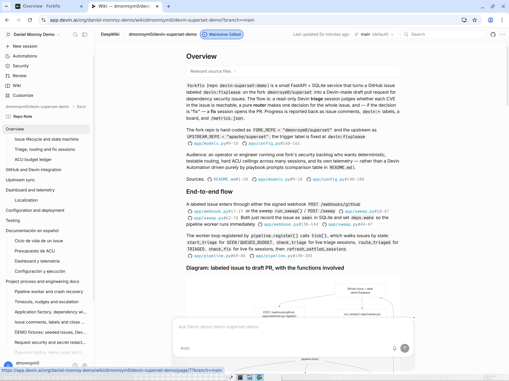
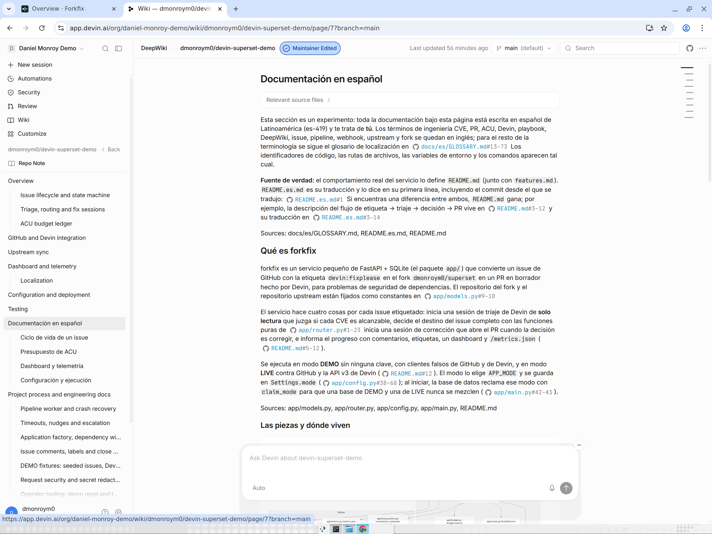
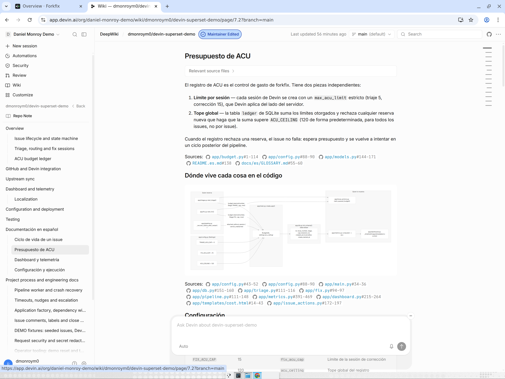

# How Devin was used

One section per capability. Each says what it did here, where to see it, and why it mattered. The evidence comes only from GitHub and this repo. Anything visible only in Daniel's Devin account is listed under **Daniel to confirm**, with the screenshot to take.

## 1. Devin API v3 sessions with structured output (in the service)
- **What:** The service creates every triage and fix session through API v3. Triage sessions **require** structured output. The service validates the output in code, and a triage result that contains a PR URL is rejected.
- **Where:**
  - Endpoints: `app/devin_client.py:5-26`, all `/v3/organizations/{org_id}/...`.
  - Triage payload: `app/triage.py:148-152`, with `max_acu_limit`, `tags`, `structured_output_schema`, `structured_output_required=True` and `devin_mode`.
  - Output parsing: `app/triage.py:60-100`. PR rejection: `app/triage.py:238-246`.
  - Fix payload: `app/fix.py:132-136`.
  - DEMO evidence: synthetic issue #9001 returns a PR and ends `needs_human` with `devin:triage-rejected` (`tests/test_e2e_demo.py`, `docs/TEST_REPORT.md` §6).
- **Why:** Structured output turns "Devin's opinion" into data the router can check: per-CVE verdict, confidence and evidence. A read-only session that opens a PR is caught by code, not by trust.

## 2. Playbooks and macros, as code
- **What:** There are two playbooks, "CVE Reachability Triage (Read-Only)" (`!cve_triage`) and "Dependency Security Fix (superset)" (`!dep_security_fix`). They're kept as text in the repo. At startup the service resolves them by title, with env overrides. A one-time bootstrap script creates any that are missing (`POST /v3/organizations/{org_id}/playbooks`). It's dry-run by default and takes `--apply`. The prompt starts with the playbook's macro.
- **Where:**
  - Playbook text: `playbooks/cve_triage.md`, `playbooks/dep_security_fix.md`.
  - Bootstrap: `scripts/bootstrap_playbooks.py:47-70`. Title resolution: `app/playbooks.py:21-38`. Macro in the prompt: `app/prompts.py:32`.
  - Preflight fails if the playbook's attached schema differs from the local copy: `app/preflight.py:176-189`.
- **Why:** Devin's Ask mode said playbooks could only be created in the UI. The docs show the create endpoint, so Daniel asked for playbooks as code (Daniel's notes). Playbook changes now go through PR review like any other code.
- **Daniel to confirm:** screenshot of Settings → Playbooks showing both playbooks, their macros, and the attached structured-output schema on the triage playbook.

## 3. Org skill `reachability-evidence-standards`
- **What:** Every triage prompt tells the session to apply this org skill.
- **Where:** `app/prompts.py:39`, README "Skills" (`README.md:143`), `docs/PLAN.md:89`.
- **Why:** Daniel reviewed the urllib3 triage (fork issue #3, comment 5926719039). The code path is real, but Devin missed that webhooks sit behind two default-off flags, `ALERT_REPORTS` and `ALERT_REPORT_WEBHOOK`. He turned that lesson into the skill so every later triage checks flag defaults and who can trigger the path (Daniel's notes).
- **Daniel to confirm:** screenshot of the skill page for `reachability-evidence-standards` (its body, plus the setting that makes it load automatically).

## 4. Repo skill `features-md`
- **What:** A repo skill holds the `features.md` rule: every feature has a row with status, files, a "how to see it" step and a requirement ID, and the PR template has a checkbox for it.
- **Where:** `.agents/skills/features-md/SKILL.md`, `features.md`, `.github/pull_request_template.md`.
- **Why:** It keeps the claim matrix next to the code. The audit used it: #9 and #11 were found by running each row's command.

## 5. Plan mode (`!plan`) and the human plan review
- **What:** The build started from a plan that Daniel reviewed. He requested changes A–K and cut the fan-out from 9 child sessions in 6 batches to 3 in one batch (Daniel's notes).
- **Where:** `docs/PLAN.md` (commit 215dc4e, 2026-10-02 04:03 UTC). The A–K change IDs appear throughout `features.md`.
- **Why:** The plan is the contract, and the audit in `docs/STATE.md` §3 checks every item against it.
- **Daniel to confirm:** screenshot of the parent session https://app.devin.ai/sessions/1ef366ee7b8a477b81656cd968b0f58e showing the `!plan` invocation and the plan-approval message. GitHub doesn't show whether `!plan` itself was used.

## 6. Child sessions during the build
- **What:** Three child sessions built the ops, Devin and GitHub sides in parallel against shared contracts (commit 28d7e44). They merged into one integration branch.
- **Where:**
  - Demo PR #1 (ops), session https://app.devin.ai/sessions/bac9bfb7c8ae4e5e9886f583838fb079
  - Demo PR #2 (Devin side), session https://app.devin.ai/sessions/a41d505f4343436c92eb16adc5a76e4a
  - Demo PR #3 (GitHub side), session https://app.devin.ai/sessions/d88cc9c7a7174d3e95b41dd05617a625
  - All three merged into `devin/1790913600-forkfix` at 04:50 UTC. Integration PR #4, from parent session 1ef366ee…, merged to main at 07:55 UTC (`docs/TIMELINE.md`).
- **Why:** Parallel build with one integration point. The contract files kept the three branches compatible.
- **Daniel to confirm:** screenshot of the parent session's child-session panel listing the three children.

## 7. Devin Review and PR monitoring
- **What:** Devin posted PR-monitoring comments on its PRs (shown below), and Devin Review reviewed them. How the monitoring works inside Devin isn't visible from GitHub and is unverified.
- **Where:**
  - Fork PR #6 has a monitoring comment at 06:51:47 and a Devin Review at 06:57 ("No Issues Found"). Fork PRs #7 and #8 have monitoring comments.
  - Demo PR #4 had several Devin Review rounds with inline findings on router/escalation/triage/config/main, from 04:56 to 05:14. Fixes came in PR #5 and in later commits (`docs/TIMELINE.md`).
  - Demo PR #18 (this audit) got Devin Review with 0 findings.
- **Why:** Automated review found real defects before merge. Daniel still made the merge calls: "#4 stays unmerged until #5 is integrated" (PR #4, comment 5946147924).

## 8. Fork dependency fixes and triage made by Devin (before the service existed)
- **What:**
  - Fork PR #6 bumps jaraco-context for CVE-2026-23949. It uses the repo's compile script and discloses the Docker Hub 429 fallback.
  - Fork PRs #7 and #8 split pytest 7 → 9 because pytest-asyncio 0.23.8 caps pytest below 9.
  - Triage comments on fork issues #2 (not reachable) and #3 (reachable).
- **Where:** https://github.com/dmonroym0/superset/pull/6, /pull/7, /pull/8, plus fork issues #2 and #3. Sessions 98aa8416…, 629a2b09… and 4041fab2…, all in `docs/TIMELINE.md`. All three PRs are still **open**; none is merged.
- **Why:** These are the real outcomes the DEMO seeds come from, and the source of the fix playbook's advice: the 429 fallback, `-o filterwarnings=default`, and stacked PRs for upper bounds (`playbooks/dep_security_fix.md`).

## 9. Session tags
- **What:** Each service session is tagged with the service tag, `issue-N` and `stage-triage` / `stage-fix`.
- **Where:** `app/triage.py:44-45`, used at `app/triage.py:148-152` and `app/fix.py:134`.
- **Why:** Sessions can be filtered per issue and per stage in the Devin UI and the API.
- **Daniel to confirm:** none exist yet. No LIVE run has happened, so no tagged session exists. After the LIVE run, take a screenshot of the sessions list filtered by tag `issue-<N>`.

## 10. `devin_mode` per stage
- **What:** Optional `DEVIN_MODE_TRIAGE` / `DEVIN_MODE_FIX` values are sent as `devin_mode`. The board has a mode column.
- **Where:** `app/config.py`, `app/triage.py:152`, `app/fix.py:136`, `app/templates/board.html:125-127`, `tests/test_devin_mode.py`. The values aren't validated: issue #13.
- **Why:** A cheaper mode can run triage while fixes use a stronger one. The build itself ran in Fusion mode (Daniel's notes).
- **Daniel to confirm:** screenshot of the parent session header showing Fusion mode.

## 11. ACU caps and the budget ceiling
- **What:** Each session gets `max_acu_limit` (triage 5, fix 15). The service also keeps a ledger and refuses to start a session if the sum of committed caps would pass `ACU_CEILING` (120). It queues the issue instead (`devin:queued-budget`).
- **Where:** `app/config.py:52-54,158-160`, `app/budget.py`, `tests/test_budget.py`. Board tile "ACUs committed vs ceiling" (`app/templates/board.html:49-55`). DEMO run: committed 60 / 120 (`docs/TEST_REPORT.md` §11).
- **Why:** Spend is bounded before a session starts, not discovered afterwards. The API's per-session metering read 0 in DEMO, and on Daniel's plan it also reads 0 for finished sessions. So the board's per-session "ACUs consumed 0.0" is misleading: issue #17.
- **Whole-project cost:** about $150 of on-demand usage plus the Pro plan, covering the build, the audits and the LIVE runs (Daniel, from Settings → Usage & Limits). That page shows $ and % of quota, not ACUs, and per-session metering reads 0, so there is no per-issue ACU figure.

## 12. DeepWiki (this repo, with a Spanish experiment)
- **What:** DeepWiki indexes `dmonroym0/devin-superset-demo` and `dmonroym0/superset` (Devin's `list_wiki_repos`, 2026-10-02). `.devin/wiki.json` (added in PR #20) steers this repo's wiki: two repo notes, an English page tree, and an experimental **"Documentación en español"** section (Ciclo de vida de un issue, Presupuesto de ACU, Dashboard y telemetría, Configuración y ejecución) whose page notes require es-419, *tú*, and `docs/es/GLOSSARY.md` terms (`tope` = ceiling, `límite` = cap).
- **Why `wiki.json` doesn't change after a regeneration:** it is an *input*. DeepWiki reads it to decide which pages to write; the generated pages live in Devin, not in git. Regenerating never writes back to the file.
- **Evidence:** a Spanish DeepWiki question about the generated "Presupuesto de ACU" page answered in Spanish and quoted "Se alcanzó el tope: las sesiones nuevas esperan hasta que lo subas o se liberen reservas", using `tope` as the glossary requires (https://app.devin.ai/search/api_5294e9e0-f95e-43e1-bcc2-9d0c80f494f0). The wiki is at https://app.devin.ai/wiki/dmonroym0/devin-superset-demo (org login required).
- **Screenshots (2026-10-02, `main`, "Maintainer Edited"):** the English Overview with the Spanish section in the page tree, the Spanish section intro, and the generated "Presupuesto de ACU" page (`Límite por sesión` / `Tope global`, matching the glossary).

  
  
  
- **Open:** native-speaker review of the Spanish pages (https://github.com/dmonroym0/devin-superset-demo/issues/23).

## 13. Other AI tools
Early on, Daniel used a general-purpose AI assistant to learn Devin's concepts and tighten his prompts without spending credit. All building was done with Devin. A coding assistant did the first pass of the urllib3 reproduction, and Daniel re-traced the code path himself (Daniel's notes).
